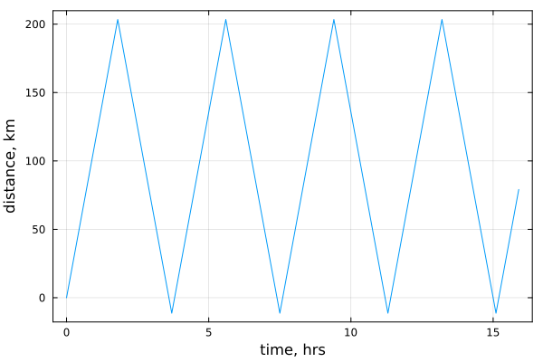

# Car travel in 1D

How a car travels back and forth between two locations.

Note that a comment which is on a line by itself, will render as a markdown line and
thus create a new "notebook block" after it.
Thus many comments are preceded by `##` to avoid this.

````julia
using Plots

# set a flag to do plotting.  This is set to false during testing.
if !@isdefined plotyes
    plotyes = true
end

"""
    update_position(X, V, dir, dt, L)

Return updated position of car and new travel direction;
given, old postion `X`, speed `V`, direction `dir`, time step `dt`
and domain size `L`.

# Example
```jldoctest
julia> update_position(0.0, 10, 1, 1, 200)
(10.0, 1)
```
"""
function update_position(X, V, dir, dt, L)
    X = X + dir*V*dt
    if X > L
        dir = -1      # if beyond L, go back (left)
    elseif X < 0
        dir = 1       # if beyond 0, go back (right)
    end
    return X, dir
end

"""
    car_travel_1D()

Run the model.
"""
function car_travel_1D()
    # Physical parameters
    V     = 113.0          # speed, km/h
    L     = 200.0          # length of segment, km
    dir   = 1              # switch 1 = go right, -1 = go left
    ttot  = 16.0           # total time, h
    # Numerical parameters
    dt    = 0.1            # time step, h
    nt    = Int(cld(ttot, dt))  # number of time steps
    # Array initialisation
    T     = zeros(nt)
    X     = zeros(nt)
    # Time loop
    for it = 2:nt
        T[it] = T[it-1] + dt
        X[it], dir = update_position(X[it - 1], V, dir, dt, L)
    end

    return T, X
end
T, X = car_travel_1D();
````

````
Precompiling packages...
    660.8 ms  ✓ StatsAPI
    668.4 ms  ✓ LaTeXStrings
    786.2 ms  ✓ TensorCore
    797.4 ms  ✓ Contour
    656.1 ms  ✓ Measures
   1132.4 ms  ✓ Statistics
   1629.6 ms  ✓ Grisu
   1135.1 ms  ✓ OrderedCollections
   2502.4 ms  ✓ Format
   1260.0 ms  ✓ Requires
    802.2 ms  ✓ StableRNGs
    747.0 ms  ✓ Reexport
   1151.9 ms  ✓ Unzip
   1089.0 ms  ✓ DocStringExtensions
    650.6 ms  ✓ SimpleBufferStream
   1203.9 ms  ✓ URIs
    912.6 ms  ✓ PtrArrays
   1168.7 ms  ✓ NaNMath
   4880.3 ms  ✓ MacroTools
   1461.7 ms  ✓ TranscodingStreams
   2504.6 ms  ✓ IrrationalConstants
    926.2 ms  ✓ DelimitedFiles
    632.6 ms  ✓ BitFlags
    792.6 ms  ✓ DataAPI
    818.6 ms  ✓ Scratch
    860.7 ms  ✓ LoggingExtras
   1360.6 ms  ✓ ConcurrentUtilities
    941.7 ms  ✓ JLLWrappers
   1058.9 ms  ✓ ExceptionUnwrapping
   1050.3 ms  ✓ Statistics → SparseArraysExt
    690.4 ms  ✓ Showoff
   2328.8 ms  ✓ UnicodeFun
    894.8 ms  ✓ AliasTables
    975.1 ms  ✓ CodecZlib
   3119.3 ms  ✓ RecipesBase
   1170.6 ms  ✓ LogExpFunctions
    972.8 ms  ✓ Missings
    817.1 ms  ✓ RelocatableFolders
   3468.5 ms  ✓ DataStructures
   4773.3 ms  ✓ FixedPointNumbers
   1309.6 ms  ✓ Graphite2_jll
   1186.5 ms  ✓ Libmount_jll
    858.1 ms  ✓ EpollShim_jll
   1407.6 ms  ✓ LLVMOpenMP_jll
   1186.4 ms  ✓ Bzip2_jll
   1350.6 ms  ✓ Xorg_libICE_jll
   1221.3 ms  ✓ Xorg_libXau_jll
   4124.6 ms  ✓ OpenSSL
   1234.7 ms  ✓ libpng_jll
   1232.4 ms  ✓ libfdk_aac_jll
   1012.5 ms  ✓ LERC_jll
   1268.8 ms  ✓ LAME_jll
   1390.8 ms  ✓ fzf_jll
   1500.2 ms  ✓ JpegTurbo_jll
   1042.3 ms  ✓ mtdev_jll
   1407.5 ms  ✓ XZ_jll
   1290.9 ms  ✓ Ogg_jll
   1300.5 ms  ✓ Xorg_libXdmcp_jll
   1083.8 ms  ✓ x264_jll
   1152.5 ms  ✓ x265_jll
   1269.6 ms  ✓ MbedTLS_jll
   1333.5 ms  ✓ libaom_jll
   1312.0 ms  ✓ Zstd_jll
   1056.0 ms  ✓ Expat_jll
   1019.9 ms  ✓ Opus_jll
   1424.7 ms  ✓ LZO_jll
   1256.8 ms  ✓ Xorg_xtrans_jll
   1110.7 ms  ✓ libevdev_jll
   1234.4 ms  ✓ Libiconv_jll
   1095.0 ms  ✓ Libffi_jll
   1234.4 ms  ✓ eudev_jll
   1246.8 ms  ✓ Libuuid_jll
   1207.7 ms  ✓ FriBidi_jll
    872.6 ms  ✓ SortingAlgorithms
   1195.2 ms  ✓ Pixman_jll
   1238.9 ms  ✓ FreeType2_jll
   1121.6 ms  ✓ Xorg_libSM_jll
   1211.6 ms  ✓ JLFzf
   2816.6 ms  ✓ ColorTypes
   1300.4 ms  ✓ libvorbis_jll
   1287.8 ms  ✓ Libtiff_jll
   2670.5 ms  ✓ Ghostscript_jll
   2228.4 ms  ✓ MbedTLS
   1270.5 ms  ✓ Dbus_jll
   3443.1 ms  ✓ Xorg_libxcb_jll
   1314.9 ms  ✓ GettextRuntime_jll
   1325.8 ms  ✓ libinput_jll
   1726.3 ms  ✓ Wayland_jll
    771.2 ms  ✓ ColorTypes → StyledStringsExt
   1870.4 ms  ✓ Fontconfig_jll
   4245.9 ms  ✓ StatsBase
   4213.1 ms  ✓ ColorVectorSpace
   1259.6 ms  ✓ Xorg_xcb_util_jll
   1304.2 ms  ✓ Xorg_libX11_jll
   2117.6 ms  ✓ Glib_jll
   1304.8 ms  ✓ Xorg_xcb_util_image_jll
   6140.5 ms  ✓ Latexify
   1229.1 ms  ✓ Xorg_xcb_util_keysyms_jll
   1264.4 ms  ✓ Xorg_xcb_util_renderutil_jll
   1482.5 ms  ✓ Xorg_xcb_util_wm_jll
   1402.2 ms  ✓ Xorg_libXrender_jll
   1695.2 ms  ✓ Xorg_libXext_jll
   1560.0 ms  ✓ Xorg_libXfixes_jll
   9991.1 ms  ✓ Colors
   1358.5 ms  ✓ Xorg_libxkbfile_jll
   1508.1 ms  ✓ Latexify → SparseArraysExt
   1285.5 ms  ✓ Xorg_xcb_util_cursor_jll
   1228.1 ms  ✓ Xorg_libXinerama_jll
   1225.8 ms  ✓ Xorg_libXrandr_jll
   1412.6 ms  ✓ Cairo_jll
   1390.7 ms  ✓ Xorg_libXcursor_jll
   1492.3 ms  ✓ Xorg_libXi_jll
   1981.0 ms  ✓ Libglvnd_jll
    937.5 ms  ✓ Xorg_xkbcomp_jll
   1250.1 ms  ✓ HarfBuzz_jll
    909.2 ms  ✓ Xorg_xkeyboard_config_jll
   1360.4 ms  ✓ libass_jll
   1473.0 ms  ✓ Pango_jll
   1169.7 ms  ✓ xkbcommon_jll
   1192.6 ms  ✓ Vulkan_Loader_jll
   1310.4 ms  ✓ libdecor_jll
   2282.9 ms  ✓ FFMPEG_jll
   1459.2 ms  ✓ GLFW_jll
    914.5 ms  ✓ FFMPEG
   2245.9 ms  ✓ Qt6Base_jll
   6879.2 ms  ✓ ColorSchemes
   1063.9 ms  ✓ Qt6ShaderTools_jll
   1559.5 ms  ✓ GR_jll
   3408.3 ms  ✓ Qt6Declarative_jll
   1129.2 ms  ✓ Qt6Wayland_jll
  29711.9 ms  ✓ HTTP
  15008.4 ms  ✓ PlotUtils
   3680.4 ms  ✓ PlotThemes
   7396.3 ms  ✓ GR
   5478.0 ms  ✓ RecipesPipeline
  64448.4 ms  ✓ Plots
  136 dependencies successfully precompiled in 130 seconds. 41 already precompiled.

````

````julia
if plotyes # do not run this when including this script from other scripts
    plot(T, X, markersize=5, xlabel="time, hrs", ylabel="distance, km", framestyle=:box, legend=:none)
end
````


Figure showing how the car bounces back and forth, nice!

